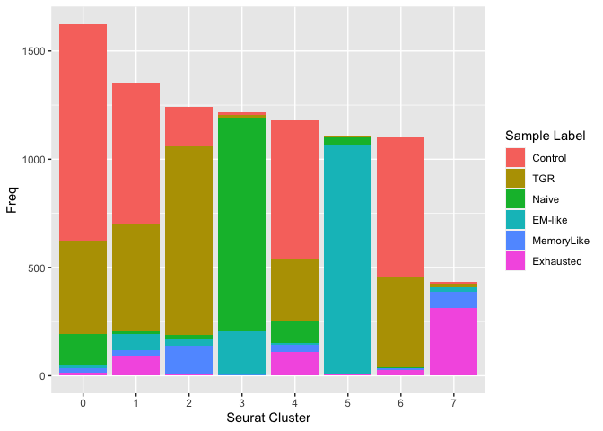

CD8_dataset_incorporation
================
pattiey
2022-08-23

Load packages

``` r
library(utils)
library(Seurat)
library(clusterProfiler)
library(dplyr)
library(tidyr)
library(Matrix)
library(sctransform)
library(ggplot2)
library(ggpubr)
library(RColorBrewer)
library(viridis)
library(ComplexHeatmap)
library(circlize)
library(goseq)
library(GEOquery)
library(msigdbr)
library(fgsea)
library(data.table)
library(tibble)
```

Load helper functions

``` r
source("cd8_analysis.R")
```

Load metadata from GEO

``` r
B16_GEO <- "GSE116390"
B16_eset <- getGEO(B16_GEO)[[1]]
```

    ## Found 1 file(s)

    ## GSE116390_series_matrix.txt.gz

``` r
met_cond_GEO <- "GSE152018"
met_cond_eset <- getGEO(met_cond_GEO)[[1]]
```

    ## Found 1 file(s)

    ## GSE152018_series_matrix.txt.gz

``` r
pData(met_cond_eset) <- pData(met_cond_eset) %>% mutate(SampleLabel = ifelse(`treatment:ch1` == "Control (11mM glucose)", "Control", "TGR"))
```

Load aggregated matrix for B16s into Seurat object

``` r
if (file.exists(file.path("Data", B16_GEO, paste0(B16_GEO, "_aggregated"))) == FALSE) {
  getGEOSuppFiles(B16_GEO, makeDirectory = TRUE, baseDir = "Data", fetch_files = TRUE)
  untar(file.path("Data", B16_GEO, paste0(B16_GEO, "_aggregated_filtered_matrix.tar.gz")), 
      list=FALSE, 
      exdir = file.path("Data", B16_GEO, paste0(B16_GEO, "_aggregated")))
}

B16.counts <- Read10X(file.path("Data", B16_GEO, paste0(B16_GEO, "_aggregated")))
(B16.seurat <- CreateSeuratObject(counts = B16.counts, 
                                   project = "B16CD8",
                                   min.cells = 3,
                                   min.features = 200))
```

    ## Warning: Feature names cannot have underscores ('_'), replacing with dashes
    ## ('-')

    ## An object of class Seurat 
    ## 13363 features across 3574 samples within 1 assay 
    ## Active assay: RNA (13363 features, 0 variable features)

``` r
sampleIDs <- qq(PMEL1_S1, WT1_S2, WT3_S3, PMEL3_S1, PMEL2_S1, WT2_S2, WT4_S3)
names(sampleIDs) <- 1:7
B16.seurat[["Sample"]] <- factor(substring(rownames(B16.seurat@meta.data), 18))
B16.seurat[["SampleLabel"]] <- factor(sampleIDs[B16.seurat@meta.data$Sample])
# B16.seurat@meta.data <- left_join(B16.seurat@meta.data, pData(B16_eset), by = c("SampleLabel" = "description"))
```

Load matrix for metabolically conditioned dataset

``` r
if (file.exists(file.path("Data", met_cond_GEO, paste0(met_cond_GEO, "_RAW"))) == FALSE){
  getGEOSuppFiles(met_cond_GEO, makeDirectory = TRUE, baseDir = "Data", fetch_files = TRUE)
  untar(file.path("Data", met_cond_GEO, paste0(met_cond_GEO, "_RAW.tar")), 
        list = FALSE,
        exdir = met_cond_dir)
}

met_cond_dir <- file.path("Data", met_cond_GEO, paste0(met_cond_GEO, "_RAW"))

dir.create(file.path(met_cond_dir, "CD8_hi"))
```

    ## Warning in dir.create(file.path(met_cond_dir, "CD8_hi")): 'Data/GSE152018/
    ## GSE152018_RAW/CD8_hi' already exists

``` r
dir.create(file.path(met_cond_dir, "CD8_lo"))
```

    ## Warning in dir.create(file.path(met_cond_dir, "CD8_lo")): 'Data/GSE152018/
    ## GSE152018_RAW/CD8_lo' already exists

``` r
file.rename(from = file.path(met_cond_dir, "GSM4598789_CD8_hi_barcodes.tsv.gz"), to = file.path(met_cond_dir, "CD8_hi", "barcodes.tsv.gz"))
```

    ## Warning in file.rename(from = file.path(met_cond_dir,
    ## "GSM4598789_CD8_hi_barcodes.tsv.gz"), : cannot rename file 'Data/GSE152018/
    ## GSE152018_RAW/GSM4598789_CD8_hi_barcodes.tsv.gz' to 'Data/GSE152018/
    ## GSE152018_RAW/CD8_hi/barcodes.tsv.gz', reason 'No such file or directory'

    ## [1] FALSE

``` r
file.rename(from = file.path(met_cond_dir, "GSM4598789_CD8_hi_genes.tsv.gz"), to = file.path(met_cond_dir, "CD8_hi", "features.tsv.gz"))
```

    ## Warning in file.rename(from = file.path(met_cond_dir,
    ## "GSM4598789_CD8_hi_genes.tsv.gz"), : cannot rename file 'Data/GSE152018/
    ## GSE152018_RAW/GSM4598789_CD8_hi_genes.tsv.gz' to 'Data/GSE152018/GSE152018_RAW/
    ## CD8_hi/features.tsv.gz', reason 'No such file or directory'

    ## [1] FALSE

``` r
file.rename(from = file.path(met_cond_dir, "GSM4598789_CD8_hi_matrix.mtx.gz"), to = file.path(met_cond_dir, "CD8_hi", "matrix.mtx.gz"))
```

    ## Warning in file.rename(from = file.path(met_cond_dir,
    ## "GSM4598789_CD8_hi_matrix.mtx.gz"), : cannot rename file 'Data/GSE152018/
    ## GSE152018_RAW/GSM4598789_CD8_hi_matrix.mtx.gz' to 'Data/GSE152018/GSE152018_RAW/
    ## CD8_hi/matrix.mtx.gz', reason 'No such file or directory'

    ## [1] FALSE

``` r
file.rename(from = file.path(met_cond_dir, "GSM4598790_CD8_lo_barcodes.tsv.gz"), to = file.path(met_cond_dir, "CD8_lo", "barcodes.tsv.gz"))
```

    ## Warning in file.rename(from = file.path(met_cond_dir,
    ## "GSM4598790_CD8_lo_barcodes.tsv.gz"), : cannot rename file 'Data/GSE152018/
    ## GSE152018_RAW/GSM4598790_CD8_lo_barcodes.tsv.gz' to 'Data/GSE152018/
    ## GSE152018_RAW/CD8_lo/barcodes.tsv.gz', reason 'No such file or directory'

    ## [1] FALSE

``` r
file.rename(from = file.path(met_cond_dir, "GSM4598790_CD8_lo_genes.tsv.gz"), to = file.path(met_cond_dir, "CD8_lo", "features.tsv.gz"))
```

    ## Warning in file.rename(from = file.path(met_cond_dir,
    ## "GSM4598790_CD8_lo_genes.tsv.gz"), : cannot rename file 'Data/GSE152018/
    ## GSE152018_RAW/GSM4598790_CD8_lo_genes.tsv.gz' to 'Data/GSE152018/GSE152018_RAW/
    ## CD8_lo/features.tsv.gz', reason 'No such file or directory'

    ## [1] FALSE

``` r
file.rename(from = file.path(met_cond_dir, "GSM4598790_CD8_lo_matrix.mtx.gz"), to = file.path(met_cond_dir, "CD8_lo", "matrix.mtx.gz"))
```

    ## Warning in file.rename(from = file.path(met_cond_dir,
    ## "GSM4598790_CD8_lo_matrix.mtx.gz"), : cannot rename file 'Data/GSE152018/
    ## GSE152018_RAW/GSM4598790_CD8_lo_matrix.mtx.gz' to 'Data/GSE152018/GSE152018_RAW/
    ## CD8_lo/matrix.mtx.gz', reason 'No such file or directory'

    ## [1] FALSE

``` r
CD8_hi.counts <- Read10X(file.path(met_cond_dir, "CD8_hi"))
CD8_lo.counts <- Read10X(file.path(met_cond_dir, "CD8_lo"))

(CD8_hi.seurat <- CreateSeuratObject(counts = CD8_hi.counts, 
                                     project = "met_cond",
                                     min.cells = 3,
                                     min.features = 200))
```

    ## An object of class Seurat 
    ## 12093 features across 3336 samples within 1 assay 
    ## Active assay: RNA (12093 features, 0 variable features)

``` r
CD8_hi.seurat[["SampleLabel"]] <- "Control"

# CD8_hi.seurat@meta.data <- left_join(CD8_hi.seurat@meta.data, pData(met_cond_eset))

(CD8_lo.seurat <- CreateSeuratObject(counts = CD8_lo.counts, 
                                     project = "met_cond",
                                     min.cells = 3,
                                     min.features = 200))
```

    ## An object of class Seurat 
    ## 12649 features across 2548 samples within 1 assay 
    ## Active assay: RNA (12649 features, 0 variable features)

``` r
CD8_lo.seurat[["SampleLabel"]] <- "TGR"

# CD8_lo.seurat@meta.data <- left_join(CD8_lo.seurat@meta.data, pData(met_cond_eset))
```

Normalize and find variable features independently

integrate CD8_hi and CD8_lo cells

``` r
data.list <- c(CD8_hi.seurat, CD8_lo.seurat)
features <- SelectIntegrationFeatures(object.list = data.list, nfeatures = 10000)

anchors <- FindIntegrationAnchors(data.list, anchor.features = features)
```

    ## Warning in CheckDuplicateCellNames(object.list = object.list): Some cell names
    ## are duplicated across objects provided. Renaming to enforce unique cell names.

    ## Scaling features for provided objects

    ## Finding all pairwise anchors

    ## Running CCA

    ## Merging objects

    ## Finding neighborhoods

    ## Finding anchors

    ##  Found 9934 anchors

    ## Filtering anchors

    ##  Retained 2029 anchors

``` r
met_cond.seurat <- IntegrateData(anchorset = anchors)
```

    ## Merging dataset 2 into 1

    ## Extracting anchors for merged samples

    ## Finding integration vectors

    ## Finding integration vector weights

    ## Integrating data

``` r
DefaultAssay(met_cond.seurat) <- "RNA"
```

percentage of ribosomal and mitochondrial genes per cell

``` r
met_cond.seurat[["percent.mito"]] <- PercentageFeatureSet(met_cond.seurat, pattern = "^mt-")
met_cond.seurat[["percent.ribo"]] <- PercentageFeatureSet(met_cond.seurat, pattern = "^Rp[ls]")
```

``` r
Idents(met_cond.seurat) <- met_cond.seurat$SampleLabel
my_cols <- c("#000000", "#E69F00", "#56B4E9", "#009E73", "#F0E442", "#0072B2", "#D55E00", "#CC79A7", "#33FF99")
VlnPlot(met_cond.seurat, features = c("nFeature_RNA", "nCount_RNA", "percent.mito", "percent.ribo"), ncol = 4, pt.size = 0.1, cols = alpha(my_cols, 0.25))
```

<!-- -->

``` r
FeatureScatter(met_cond.seurat, feature1 = "nCount_RNA", feature2 = "percent.mito", cols = alpha(my_cols, 0.25))
```

<!-- -->

``` r
FeatureScatter(met_cond.seurat, feature1 = "nCount_RNA", feature2 = "nFeature_RNA", cols = alpha(my_cols, 0.25))
```

<!-- -->

``` r
FeatureScatter(met_cond.seurat, feature1 = "nCount_RNA", feature2 = "percent.ribo", cols = alpha(my_cols, 0.25))
```

<!-- -->

``` r
FeatureScatter(met_cond.seurat, feature1 = "percent.mito", feature2 = "percent.ribo", cols = alpha(my_cols, 0.25))
```

<!-- -->

Filter cells with high mito

``` r
met_cond.seurat <- subset(met_cond.seurat, subset = percent.mito < 10)
VlnPlot(met_cond.seurat, features = c("nFeature_RNA", "nCount_RNA", "percent.mito", "percent.ribo", cols = alpha(my_cols, 0.25)), ncol = 4, pt.size = 0.1)
```

    ## Warning in FetchData.Seurat(object = object, vars = features, slot = slot): The
    ## following requested variables were not found: #00000040, #E69F0040, #56B4E940,
    ## #009E7340, #F0E44240, #0072B240, #D55E0040, #CC79A740, #33FF9940

<!-- -->

Remove mitochondial and ribosomal genes

``` r
mito.genes <- grep(pattern = "^mt-", x = rownames(x = met_cond.seurat@assays$RNA@data), value = TRUE)
ribo.genes <- grep(pattern = "^Rp[ls]", x = rownames(x = met_cond.seurat@assays$RNA@data), value = TRUE)
```

``` r
DefaultAssay(met_cond.seurat) <- "integrated"
met_cond.seurat <- FindVariableFeatures(met_cond.seurat, selection.method = "vst", nfeatures = 7500)
```

    ## Warning in FindVariableFeatures.Assay(object = assay.data, selection.method =
    ## selection.method, : selection.method set to 'vst' but count slot is empty; will
    ## use data slot instead

    ## Warning in eval(predvars, data, env): NaNs produced

    ## Warning in hvf.info$variance.expected[not.const] <- 10^fit$fitted: number of
    ## items to replace is not a multiple of replacement length

``` r
(top10 <- head(VariableFeatures(met_cond.seurat), 10))
```

    ##  [1] "Fkbp1a"  "Aprt"    "Son"     "Lsm3"    "Pim1"    "Nhp2"    "Gm10073"
    ##  [8] "Gmnn"    "Gnas"    "Arl4c"

``` r
length(met_cond.seurat@assays$integrated@var.features)
```

    ## [1] 7500

``` r
met_cond.seurat@assays$integrated@var.features <-
  met_cond.seurat@assays$integrated@var.features[!met_cond.seurat@assays$integrated@var.features %in% 
                                        c(mito.genes,ribo.genes)]
length(met_cond.seurat@assays$integrated@var.features)
```

    ## [1] 7436

``` r
(top10 <- head(VariableFeatures(met_cond.seurat), 10))
```

    ##  [1] "Fkbp1a"  "Aprt"    "Son"     "Lsm3"    "Pim1"    "Nhp2"    "Gm10073"
    ##  [8] "Gmnn"    "Gnas"    "Arl4c"

``` r
LabelPoints(plot = VariableFeaturePlot(met_cond.seurat), points = top10, repel = TRUE, xnudge = 0, ynudge = 0)
```

    ## Warning in self$trans$transform(x): NaNs produced

    ## Warning: Transformation introduced infinite values in continuous x-axis

    ## Warning: Removed 97 rows containing missing values (geom_point).

<!-- -->

Scale data

``` r
met_cond.seurat <- ScaleData(met_cond.seurat, assay = "integrated")
```

    ## Centering and scaling data matrix

Run PCA and dimensionality reduction

``` r
set.seed(123)
met_cond.seurat <- dim_reductions(met_cond.seurat)
```

    ## PC_ 1 
    ## Positive:  Atp5g1, Ranbp1, Hnrnpab, H2afz, Ptma, Set, Top2a, Tuba1b, Uqcr11, Ube2s 
    ## Negative:  Btg1, H2-Eb1, Cd79a, H2-Aa, Gm26740, Spns3, Kmo, Themis2, Slc46a2, Actg1 
    ## PC_ 2 
    ## Positive:  Cenpf, H2afv, Top2a, Tubb5, Nusap1, H2afx, Arl6ip1, Smc4, Ube2c, Malat1 
    ## Negative:  Eif5a, Gzmb, Srm, Cnbp, Tomm5, Ncl, Ranbp1, Nme1, Fabp5, Nhp2 
    ## PC_ 3 
    ## Positive:  Bcl2, Scd2, Il2ra, Zfos1, Kcnq1ot1, Gm42418, Sema4d, Cdk6, Spn, Ptprc 
    ## Negative:  Ppia, Stmn1, Ptma, Hmgb2, H2afz, 2810417H13Rik, Prdx1, Psmb2, Ubb, Ran 
    ## PC_ 4 
    ## Positive:  2810417H13Rik, H2afz, Actb, Cbx3, Top2a, Ptma, Tmsb10, Xist, Rpgrip1, Dut 
    ## Negative:  Ubb, S100a10, Itm2b, Actg1, Ddit4, Btg1, Eif1, Aldoa, Clta, Ctla2a 
    ## PC_ 5 
    ## Positive:  Mt1, Mt2, Aldoa, Tubb5, Gapdh, Batf3, Npm1, Eif4ebp1, Fam162a, Bnip3 
    ## Negative:  Crip1, Ly6a, Ms4a4b, Ly6e, Nkg7, Ms4a6b, H2-K1, Ptprcap, Bcl2, Ppia

    ## Warning: The default method for RunUMAP has changed from calling Python UMAP via reticulate to the R-native UWOT using the cosine metric
    ## To use Python UMAP via reticulate, set umap.method to 'umap-learn' and metric to 'correlation'
    ## This message will be shown once per session

    ## 14:18:32 UMAP embedding parameters a = 0.9922 b = 1.112

    ## 14:18:32 Read 5673 rows and found 10 numeric columns

    ## 14:18:32 Using Annoy for neighbor search, n_neighbors = 30

    ## 14:18:32 Building Annoy index with metric = cosine, n_trees = 50

    ## 0%   10   20   30   40   50   60   70   80   90   100%

    ## [----|----|----|----|----|----|----|----|----|----|

    ## **************************************************|
    ## 14:18:33 Writing NN index file to temp file /var/folders/1f/5679s20d5gq3zmx40pr76lgc0000gp/T//RtmpRaRw3C/filea1de55efa1bb
    ## 14:18:33 Searching Annoy index using 1 thread, search_k = 3000
    ## 14:18:34 Annoy recall = 100%
    ## 14:18:35 Commencing smooth kNN distance calibration using 1 thread with target n_neighbors = 30
    ## 14:18:36 Initializing from normalized Laplacian + noise (using irlba)
    ## 14:18:36 Commencing optimization for 500 epochs, with 232132 positive edges
    ## 14:18:45 Optimization finished

``` r
VizDimLoadings(met_cond.seurat, dims = 1:9, reduction = "pca") + theme(axis.text = element_text(size=5),
                                                                       axis.title = element_text(size=8, face="bold"))
```

<!-- -->

``` r
mat <- GetAssayData(met_cond.seurat, assay = "integrated", slot = "scale.data")
pca <- met_cond.seurat[["pca"]]

total_var <- sum(matrixStats::rowVars(mat))
eigValues = (pca@stdev)^2
(varExplained <- eigValues / total_var)
```

    ##  [1] 0.0134297002 0.0045974543 0.0035818606 0.0023389355 0.0018653293
    ##  [6] 0.0015926744 0.0014220381 0.0012577044 0.0011744272 0.0010766188
    ## [11] 0.0010325717 0.0009873948 0.0009483998 0.0008873859 0.0008566283
    ## [16] 0.0008255267 0.0008055600 0.0007980310 0.0007721391 0.0007418101
    ## [21] 0.0007318316 0.0007253745 0.0007077462 0.0007046877 0.0006925562
    ## [26] 0.0006909397 0.0006864031 0.0006757176 0.0006668009 0.0006560620
    ## [31] 0.0006526416 0.0006511924 0.0006454301 0.0006445907 0.0006402338
    ## [36] 0.0006397247 0.0006389149 0.0006368639 0.0006342907 0.0006335044
    ## [41] 0.0006311504 0.0006291931 0.0006278486 0.0006262871 0.0006256257
    ## [46] 0.0006252123 0.0006237259 0.0006233905 0.0006210539 0.0006208218

``` r
ElbowPlot(met_cond.seurat)
```

<!-- -->

``` r
DimHeatmap(met_cond.seurat, dims = 1:6, nfeatures = 20, cells = 500, balanced = TRUE)
```

<!-- -->

``` r
DimPlot(met_cond.seurat, reduction = "pca", group.by = "SampleLabel", dims = c(1,2), cols = alpha(my_cols, 0.5))
```

<!-- -->

UMAP

``` r
DimPlot(met_cond.seurat, reduction = "umap", group.by = "SampleLabel", dims = c(1,2),  cols = alpha(my_cols, .75))
```

<!-- -->
DEGs identified in nature metabolism paper

``` r
genes_of_interest <- c("Tcf7","Atf4", "Ddit3", "Ifng", "Slc2a1")

FeaturePlot(met_cond.seurat, features = c("2810417H13Rik", "Ranbp1", "Npc2", "Btg1"), reduction = "umap", cols = alpha(c("blue", "red"), 0.5))
```

    ## Warning: Could not find Npc2 in the default search locations, found in RNA assay
    ## instead

<!-- -->

``` r
FeaturePlot(met_cond.seurat, features = genes_of_interest, reduction = "umap", cols = alpha(c("blue", "red"), 0.25))
```

<!-- -->

``` r
met_cond.seurat %>% subset(subset = SampleLabel == "Control") %>% FeaturePlot(features = genes_of_interest, reduction = "umap", cols =alpha(c("blue", "red"), 0.25))
```

<!-- -->

``` r
met_cond.seurat %>% subset(subset = SampleLabel == "TGR") %>% FeaturePlot(features = genes_of_interest, reduction = "umap", cols = alpha(c("blue", "red"), 0.25))
```

<!-- -->

``` r
DoHeatmap(met_cond.seurat, features = genes_of_interest, group.by = "SampleLabel", raster=FALSE)
```

<!-- -->

# TODO

DEA on metabolically conditioned cells

``` r
TGR.de.markers <- FindMarkers(met_cond.seurat, ident.1 = "Control", ident.2 = "TGR")
TGR.de.markers %>% filter(p_val_adj < 0.05) %>% arrange(desc(abs(avg_log2FC))) %>% head(20)
```

    ##                      p_val avg_log2FC pct.1 pct.2    p_val_adj
    ## Cenpa         5.194806e-23  0.6008667 0.683 0.993 5.194806e-19
    ## Mt2           8.672757e-93 -0.5600283 0.111 0.379 8.672757e-89
    ## 2810417H13Rik 3.775149e-88  0.5430860 0.878 1.000 3.775149e-84
    ## Cenpf         2.231857e-26  0.5344509 0.465 1.000 2.231857e-22
    ## Stmn1         8.907895e-70  0.5192411 0.883 1.000 8.907895e-66
    ## Calr          1.491893e-35  0.4970845 0.661 0.830 1.491893e-31
    ## Atp5g1        2.286899e-75  0.4821504 0.870 0.956 2.286899e-71
    ## Cks1b         8.638963e-33  0.4807855 0.753 1.000 8.638963e-29
    ## Ranbp1        2.107706e-54  0.4801605 0.834 0.998 2.107706e-50
    ## Tfrc          1.439075e-27  0.4697622 0.376 0.898 1.439075e-23
    ## Cks2          3.652471e-11  0.4674894 0.684 0.998 3.652471e-07
    ## Top2a         2.524791e-20  0.4638406 0.711 0.897 2.524791e-16
    ## Cenpw         6.608526e-40  0.4498249 0.476 0.659 6.608526e-36
    ## Ube2s         4.425780e-48  0.4386305 0.860 0.996 4.425780e-44
    ## Tpx2          2.946517e-50  0.4334260 0.350 0.907 2.946517e-46
    ## Calm3         2.759432e-20  0.4211869 0.691 0.927 2.759432e-16
    ## Cdca8         2.623390e-17  0.4192844 0.486 0.987 2.623390e-13
    ## Ccna2         1.837997e-24  0.4181327 0.453 0.978 1.837997e-20
    ## Lig1          2.143079e-09  0.4165616 0.509 0.979 2.143079e-05
    ## Birc5         7.631000e-29  0.4060915 0.749 1.000 7.631000e-25

``` r
TGR.deg <- TGR.de.markers %>% filter(p_val_adj < 0.05)
```

``` r
FeaturePlot(met_cond.seurat, features = c("Cenpa", "Mt2", "2810417H13Rik"), cols = alpha(c("blue", "red"), 0.25), reduction = "umap")
```

<!-- -->

``` r
met_cond.seurat %>% subset(subset = SampleLabel == "Control") %>%  FeaturePlot(features = c("Cenpa", "Mt2", "2810417H13Rik"), cols = alpha(c("blue", "red"), 0.25), reduction = "umap")
```

<!-- -->

``` r
met_cond.seurat %>% subset(subset = SampleLabel == "TGR") %>%  FeaturePlot(features = c("Cenpa", "Mt2", "2810417H13Rik"), cols = alpha(c("blue", "red"), 0.25), reduction = "umap")
```

<!-- -->

Hypergeometric GSEA

``` r
KEGG.mouse.db <- msigdbr(species = "mouse", category = "C2", subcategory = "KEGG")
```

``` r
hyper.kegg.dt <- run.hyper.test(TGR.deg, KEGG.mouse.db, met_cond.seurat, cutoff = 0.05)
hyper.kegg.dt %>%
  arrange(p.val) %>%
  filter(p.val < 0.05) %>% 
  knitr::kable()
```

| gs_name                                       |   m |   q |    n |   k |     p.val |
|:----------------------------------------------|----:|----:|-----:|----:|----------:|
| KEGG_OXIDATIVE_PHOSPHORYLATION                |  77 |  16 | 2450 | 107 | 0.0000000 |
| KEGG_PARKINSONS_DISEASE                       |  71 |  14 | 2456 | 107 | 0.0000001 |
| KEGG_SPLICEOSOME                              |  82 |  14 | 2445 | 107 | 0.0000009 |
| KEGG_HUNTINGTONS_DISEASE                      | 102 |  15 | 2425 | 107 | 0.0000032 |
| KEGG_ALZHEIMERS_DISEASE                       | 100 |  14 | 2427 | 107 | 0.0000119 |
| KEGG_CARDIAC_MUSCLE_CONTRACTION               |  35 |   7 | 2492 | 107 | 0.0000721 |
| KEGG_CELL_CYCLE                               | 104 |  13 | 2423 | 107 | 0.0000831 |
| KEGG_DNA_REPLICATION                          |  33 |   5 | 2494 | 107 | 0.0021795 |
| KEGG_P53_SIGNALING_PATHWAY                    |  49 |   6 | 2478 | 107 | 0.0039559 |
| KEGG_PYRIMIDINE_METABOLISM                    |  69 |   7 | 2458 | 107 | 0.0077223 |
| KEGG_PROGESTERONE_MEDIATED_OOCYTE_MATURATION  |  57 |   6 | 2470 | 107 | 0.0092168 |
| KEGG_DRUG_METABOLISM_OTHER_ENZYMES            |  11 |   2 | 2516 | 107 | 0.0094998 |
| KEGG_OOCYTE_MEIOSIS                           |  72 |   7 | 2455 | 107 | 0.0099499 |
| KEGG_PATHOGENIC_ESCHERICHIA_COLI_INFECTION    |  32 |   4 | 2495 | 107 | 0.0100075 |
| KEGG_PPAR_SIGNALING_PATHWAY                   |  26 |   3 | 2501 | 107 | 0.0221232 |
| KEGG_ANTIGEN_PROCESSING_AND_PRESENTATION      |  41 |   4 | 2486 | 107 | 0.0275670 |
| KEGG_RNA_DEGRADATION                          |  43 |   4 | 2484 | 107 | 0.0331323 |
| KEGG_GAP_JUNCTION                             |  45 |   4 | 2482 | 107 | 0.0393534 |
| KEGG_VASOPRESSIN_REGULATED_WATER_REABSORPTION |  31 |   3 | 2496 | 107 | 0.0396359 |
| KEGG_MATURITY_ONSET_DIABETES_OF_THE_YOUNG     |   1 |   0 | 2526 | 107 | 0.0423427 |
| KEGG_PROTEASOME                               |  32 |   3 | 2495 | 107 | 0.0438685 |

Ranked GSEA

``` r
num.sci <- function(x) {
    format(x, scientific=TRUE, digits = 2)
}

make.gs.lol <- function(.dt) {
  .dt <- as.data.table(.dt) %>% unique()
  .list <- 
    .dt[, .(gene = .(gene_symbol)), by = .(gs_name)] %>% 
    as.list()
  .names <- .list$gs_name
  .ret <- .list$gene
  names(.ret) <- .names
  return(.ret)
}

KEGG.lol <- KEGG.mouse.db %>% select(gene_symbol, gs_name) %>% make.gs.lol()
```

``` r
ggplot(TGR.de.markers, aes(1:nrow(TGR.de.markers), -log10(p_val_adj))) + 
  geom_point(stroke = 0) + 
  geom_hline(yintercept = 4, lty = 2, colour = "red") + 
  geom_hline(yintercept = 32, lty = 2, colour = "green") +
  geom_hline(yintercept = 64, lty = 2, colour = "blue") + 
  scale_y_continuous("adjusted p-val", breaks = c(4,32,64), 
                     labels = function(x) num.sci(10^(-x)))
```

<!-- -->

``` r
deg.scores <- TGR.de.markers %>%
  mutate(adj_p_val = p_val_adj + 1e-300) %>% 
  mutate(v = -log10(adj_p_val)) %>% 
  (function(.dt) {v <- .dt$v; names(v) <- rownames(.dt); v})
```

``` r
kegg.fgsea <- fgsea(pathways = KEGG.lol, stats = deg.scores, scoreType = "pos")
```

    ## Warning in preparePathwaysAndStats(pathways, stats, minSize, maxSize, gseaParam, : There are ties in the preranked stats (0.27% of the list).
    ## The order of those tied genes will be arbitrary, which may produce unexpected results.

``` r
kegg.fgsea[,
           topGenes := paste0(head(unlist(`leadingEdge`), 3), collapse=", "),
           by = .(pathway)]

kegg.fgsea %>%
  arrange(pval) %>%
  filter(pval < 0.1) %>% 
  select(-leadingEdge) %>% 
  knitr::kable()
```

| pathway                                      |      pval |      padj |   log2err |        ES |      NES | size | topGenes           |
|:---------------------------------------------|----------:|----------:|----------:|----------:|---------:|-----:|:-------------------|
| KEGG_B\_CELL_RECEPTOR_SIGNALING_PATHWAY      | 0.0019054 | 0.1791099 | 0.4550599 | 1.0000000 | 2.019481 |    1 | Ifitm1             |
| KEGG_OOCYTE_MEIOSIS                          | 0.0059861 | 0.2511272 | 0.4070179 | 0.8820417 | 1.476794 |   11 | Ccnb1, Cdk1, Cdc20 |
| KEGG_ECM_RECEPTOR_INTERACTION                | 0.0084444 | 0.2511272 | 0.3807304 | 0.9945652 | 2.008506 |    1 | Hmmr               |
| KEGG_CELL_CYCLE                              | 0.0106863 | 0.2511272 | 0.3807304 | 0.8074227 | 1.383267 |   18 | Ccnb1, Cdk1, Cdc20 |
| KEGG_P53_SIGNALING_PATHWAY                   | 0.0459540 | 0.8639361 | 0.2089550 | 0.8696448 | 1.411497 |    6 | Ccnb1, Cdk1, Ccnb2 |
| KEGG_PROGESTERONE_MEDIATED_OOCYTE_MATURATION | 0.0579421 | 0.9077589 | 0.1847065 | 0.8440555 | 1.385064 |    7 | Ccnb1, Cdk1, Ccnb2 |

QC and filtering on B16 dataset

``` r
B16.seurat[["percent.mito"]] <- PercentageFeatureSet(B16.seurat, pattern = "^mt-")
B16.seurat[["percent.ribo"]] <- PercentageFeatureSet(B16.seurat, pattern = "^Rp[ls]")
VlnPlot(B16.seurat, features = c("nFeature_RNA", "nCount_RNA", "percent.mito", "percent.ribo"), ncol = 4, pt.size = 0.1)
```

<!-- -->

Normalize and scale

``` r
B16.seurat <- NormalizeData(B16.seurat)
B16.seurat <- FindVariableFeatures(B16.seurat, selection.method = "vst", mean.cutoff = c(0.0125, 3), dispersion.cutoff = c(0.5, Inf))
(top10 <- head(VariableFeatures(B16.seurat), 10))
```

    ##  [1] "Ccl1"      "Xcl1"      "Ccl3"      "Ccl4"      "Hist1h2ap" "Spp1"     
    ##  [7] "Gzma"      "Ube2c"     "Cd74"      "Ifitm1"

``` r
length(B16.seurat@assays$RNA@var.features)
```

    ## [1] 2000

``` r
B16.seurat@assays$RNA@var.features <-
  B16.seurat@assays$RNA@var.features[!B16.seurat@assays$RNA@var.features %in% 
                                        c(mito.genes,ribo.genes)]
length(B16.seurat@assays$RNA@var.features)
```

    ## [1] 1975

``` r
(top10 <- head(VariableFeatures(B16.seurat), 10))
```

    ##  [1] "Ccl1"      "Xcl1"      "Ccl3"      "Ccl4"      "Hist1h2ap" "Spp1"     
    ##  [7] "Gzma"      "Ube2c"     "Cd74"      "Ifitm1"

``` r
LabelPoints(plot = VariableFeaturePlot(B16.seurat), points = top10, repel = TRUE, xnudge = 0, ynudge = 0)
```

<!-- -->

``` r
B16.seurat <- ScaleData(B16.seurat, assay = "RNA")
```

    ## Centering and scaling data matrix

``` r
set.seed(123)
B16.seurat <- dim_reductions(B16.seurat)
```

    ## PC_ 1 
    ## Positive:  Klf2, Tcf7, Sell, Il7r, Lef1, Ly6c2, Nsg2, Satb1, Bcl2, Ccr7 
    ## Negative:  2810417H13Rik, Stmn1, Cks1b, Birc5, Spc24, Ccna2, Tk1, Dut, Rrm2, Cdca8 
    ## PC_ 2 
    ## Positive:  Tigit, Bhlhe40, Lag3, Tnfrsf9, Pdcd1, Rgs16, S100a6, Anxa2, S100a4, Bcl2a1b 
    ## Negative:  Ccna2, Nusap1, Cdk1, Birc5, Esco2, Fbxo5, Mxd3, Cenpf, Shcbp1, Spc24 
    ## PC_ 3 
    ## Positive:  Npm1, Nme2, C1qbp, Eif5a, Impdh2, Hspe1, Hsp90ab1, Fbl, Pa2g4, Mettl1 
    ## Negative:  Ccl5, S100a6, Gzmk, S100a10, AW112010, Cxcr6, S100a4, Lgals3, Tmsb4x, S100a11 
    ## PC_ 4 
    ## Positive:  Ccr7, Nrgn, Tnfrsf4, Cd74, Nrn1, Cd83, Igfbp7, Rgs16, Cd81, Gpm6b 
    ## Negative:  Actb, Pfn1, Cfl1, Isg15, Ly6c2, Tmsb4x, Nkg7, Ccl5, Gzmk, Zbp1 
    ## PC_ 5 
    ## Positive:  Lyz2, Apoe, Tyrobp, Fcer1g, Wfdc17, C1qb, Lgmn, Aif1, C1qc, C1qa 
    ## Negative:  Tox, Lag3, Pdcd1, Rgs16, Mmd, Tigit, Tnfrsf9, Pglyrp1, Sh2d2a, Klrc1

    ## 14:19:40 UMAP embedding parameters a = 0.9922 b = 1.112

    ## 14:19:40 Read 3574 rows and found 10 numeric columns

    ## 14:19:40 Using Annoy for neighbor search, n_neighbors = 30

    ## 14:19:40 Building Annoy index with metric = cosine, n_trees = 50

    ## 0%   10   20   30   40   50   60   70   80   90   100%

    ## [----|----|----|----|----|----|----|----|----|----|

    ## **************************************************|
    ## 14:19:40 Writing NN index file to temp file /var/folders/1f/5679s20d5gq3zmx40pr76lgc0000gp/T//RtmpRaRw3C/filea1de41b793e0
    ## 14:19:40 Searching Annoy index using 1 thread, search_k = 3000
    ## 14:19:41 Annoy recall = 100%
    ## 14:19:42 Commencing smooth kNN distance calibration using 1 thread with target n_neighbors = 30
    ## 14:19:44 Initializing from normalized Laplacian + noise (using irlba)
    ## 14:19:44 Commencing optimization for 500 epochs, with 142442 positive edges
    ## 14:19:49 Optimization finished

``` r
VizDimLoadings(B16.seurat, dims = 1:9, reduction = "pca") + theme(axis.text = element_text(size=5),
                                                                       axis.title = element_text(size=8, face="bold"))
```

<!-- -->

``` r
mat <- GetAssayData(B16.seurat, assay = "RNA", slot = "scale.data")
pca <- B16.seurat[["pca"]]

total_var <- sum(matrixStats::rowVars(mat))
eigValues = (pca@stdev)^2
(varExplained <- eigValues / total_var)
```

    ##  [1] 0.070849209 0.025552893 0.017255646 0.010604677 0.007755564 0.006520663
    ##  [7] 0.006096587 0.005715977 0.005427598 0.003880395 0.003641562 0.003350909
    ## [13] 0.003067160 0.002672605 0.002519883 0.002437895 0.002294561 0.002263745
    ## [19] 0.002240768 0.002085351 0.001983549 0.001964509 0.001948462 0.001892901
    ## [25] 0.001842385 0.001803410 0.001792710 0.001775461 0.001714933 0.001707547
    ## [31] 0.001678465 0.001669609 0.001643362 0.001619633 0.001603671 0.001600202
    ## [37] 0.001581278 0.001565321 0.001552913 0.001526928 0.001523392 0.001510166
    ## [43] 0.001499302 0.001492404 0.001488952 0.001469935 0.001460432 0.001447965
    ## [49] 0.001444475 0.001433927

``` r
ElbowPlot(B16.seurat)
```

<!-- -->

``` r
DimHeatmap(B16.seurat, dims = 1:6, nfeatures = 20, cells = 500, balanced = TRUE)
```

<!-- -->

``` r
DimPlot(B16.seurat, reduction = "pca", group.by = "SampleLabel", dims = c(1,2), cols = alpha(my_cols, 0.5))
```

<!-- -->

``` r
DimPlot(B16.seurat, reduction = "umap", group.by = "SampleLabel", dims = c(1,2), cols = alpha(my_cols, 0.5))
```

<!-- -->

Combine datasets

``` r
data.list <- c(CD8_hi.seurat, CD8_lo.seurat, B16.seurat)
features <- SelectIntegrationFeatures(object.list = data.list, nfeatures = 10000)

anchors <- FindIntegrationAnchors(data.list, anchor.features = features)
```

    ## Warning in CheckDuplicateCellNames(object.list = object.list): Some cell names
    ## are duplicated across objects provided. Renaming to enforce unique cell names.

    ## Scaling features for provided objects

    ## Finding all pairwise anchors

    ## Running CCA

    ## Merging objects

    ## Finding neighborhoods

    ## Finding anchors

    ##  Found 9959 anchors

    ## Filtering anchors

    ##  Retained 2082 anchors

    ## Running CCA

    ## Merging objects

    ## Finding neighborhoods

    ## Finding anchors

    ##  Found 11842 anchors

    ## Filtering anchors

    ##  Retained 1365 anchors

    ## Running CCA

    ## Merging objects

    ## Finding neighborhoods

    ## Finding anchors

    ##  Found 9940 anchors

    ## Filtering anchors

    ##  Retained 1252 anchors

``` r
combined <- IntegrateData(anchorset = anchors)
```

    ## Merging dataset 2 into 1

    ## Extracting anchors for merged samples

    ## Finding integration vectors

    ## Finding integration vector weights

    ## Integrating data

    ## Merging dataset 3 into 1 2

    ## Extracting anchors for merged samples

    ## Finding integration vectors

    ## Finding integration vector weights

    ## Integrating data

``` r
DefaultAssay(combined) <- "RNA"
```

Let’s just see what happens?

``` r
combined[["percent.mito"]] <- PercentageFeatureSet(combined, pattern = "^mt-")
combined[["percent.ribo"]] <- PercentageFeatureSet(combined, pattern = "^Rp[ls]")
```

``` r
VlnPlot(combined, features = c("nFeature_RNA", "nCount_RNA", "percent.mito", "percent.ribo"), ncol = 4, pt.size = 0.1, cols = alpha(my_cols, 0.5))
```

<!-- -->

``` r
FeatureScatter(combined, feature1 = "nCount_RNA", feature2 = "percent.mito", cols = alpha(my_cols, 0.5))
```

<!-- -->

``` r
FeatureScatter(combined, feature1 = "nCount_RNA", feature2 = "nFeature_RNA", cols = alpha(my_cols, 0.5))
```

<!-- -->

``` r
FeatureScatter(combined, feature1 = "nCount_RNA", feature2 = "percent.ribo", cols = alpha(my_cols, 0.5))
```

<!-- -->

``` r
FeatureScatter(combined, feature1 = "percent.mito", feature2 = "percent.ribo", cols = alpha(my_cols, 0.5))
```

<!-- -->

Filter cells with high mito

``` r
combined <- subset(combined, subset = percent.mito < 10)
VlnPlot(combined, features = c("nFeature_RNA", "nCount_RNA", "percent.mito", "percent.ribo"), ncol = 4, pt.size = 0.1, cols = alpha(my_cols, 0.5))
```

<!-- -->

Remove mitochondial and ribosomal genes

``` r
mito.genes <- grep(pattern = "^mt-", x = rownames(x = combined@assays$RNA@data), value = TRUE)
ribo.genes <- grep(pattern = "^Rp[ls]", x = rownames(x = combined@assays$RNA@data), value = TRUE)
```

``` r
DefaultAssay(combined) <- "integrated"
combined <- FindVariableFeatures(combined, selection.method = "vst", nfeatures = 7500)
```

    ## Warning in FindVariableFeatures.Assay(object = assay.data, selection.method =
    ## selection.method, : selection.method set to 'vst' but count slot is empty; will
    ## use data slot instead

    ## Warning in eval(predvars, data, env): NaNs produced

    ## Warning in hvf.info$variance.expected[not.const] <- 10^fit$fitted: number of
    ## items to replace is not a multiple of replacement length

``` r
(top10 <- head(VariableFeatures(combined), 10))
```

    ##  [1] "Bax"     "Bcl2"    "Npm3"    "Itgb7"   "Klf6"    "Arf1"    "Slfn2"  
    ##  [8] "Zyx"     "Hnrnpdl" "Uqcrb"

``` r
length(combined@assays$integrated@var.features)
```

    ## [1] 7500

``` r
combined@assays$integrated@var.features <-
  combined@assays$integrated@var.features[!combined@assays$integrated@var.features %in% 
                                        c(mito.genes,ribo.genes)]
length(combined@assays$integrated@var.features)
```

    ## [1] 7434

``` r
(top10 <- head(VariableFeatures(combined), 10))
```

    ##  [1] "Bax"     "Bcl2"    "Npm3"    "Itgb7"   "Klf6"    "Arf1"    "Slfn2"  
    ##  [8] "Zyx"     "Hnrnpdl" "Uqcrb"

``` r
LabelPoints(plot = VariableFeaturePlot(combined), points = top10, repel = TRUE, xnudge = 0, ynudge = 0)
```

    ## Warning in self$trans$transform(x): NaNs produced

    ## Warning: Transformation introduced infinite values in continuous x-axis

    ## Warning: Removed 321 rows containing missing values (geom_point).

<!-- -->

Scale data

``` r
combined <- ScaleData(combined, assay = "integrated")
```

    ## Centering and scaling data matrix

Run PCA and dimensionality reduction

``` r
set.seed(123)
combined <- dim_reductions(combined)
```

    ## PC_ 1 
    ## Positive:  Btg1, Ccl5, Gm26740, Samhd1, Ypel3, Malat1, Cd79a, Ifi203, Gbp2, A630023P12Rik 
    ## Negative:  Ranbp1, Atp5g1, Ptma, 2810417H13Rik, Hnrnpab, H2afz, Tuba1b, Set, Nme1, Eif5a 
    ## PC_ 2 
    ## Positive:  Ccl5, Cxcr6, S100a6, S100a4, Malat1, Ccl4, H2-Q7, Ubb, Ccr2, Ms4a4b 
    ## Negative:  Npm1, Hspe1, Nme2, Ptma, Gm10709, Ranbp1, Gnl3, Eif5a, Ung, Gm5786 
    ## PC_ 3 
    ## Positive:  Stmn1, H2afv, Cenpf, Tubb5, Nusap1, Birc5, Ube2c, Smc4, Top2a, H2afx 
    ## Negative:  Gzmb, Ccl5, Ccl4, Il2ra, Srm, Cxcr6, Tomm5, Mt1, Eif5a, S100a4 
    ## PC_ 4 
    ## Positive:  Gm42418, Kcnq1ot1, Ankrd11, Gprin3, Nup210, Malat1, Il7r, Bcl2, Cmah, Mtch1 
    ## Negative:  Ppia, Pfn1, Cfl1, Prdx1, Tmsb4x, Gapdh, Rbm3, Psmb2, Actg1, Ubb 
    ## PC_ 5 
    ## Positive:  Ctla2a, Mt1, Mt2, Pold4, Aldoa, Gapdh, Klrd1, Fam162a, Lag3, Eif1 
    ## Negative:  Crip1, Tmsb10, 2810417H13Rik, Pfn1, H2afz, Stmn1, Tmsb4x, Siva1, Dut, Ppia

    ## 14:32:23 UMAP embedding parameters a = 0.9922 b = 1.112

    ## 14:32:23 Read 9247 rows and found 10 numeric columns

    ## 14:32:23 Using Annoy for neighbor search, n_neighbors = 30

    ## 14:32:23 Building Annoy index with metric = cosine, n_trees = 50

    ## 0%   10   20   30   40   50   60   70   80   90   100%

    ## [----|----|----|----|----|----|----|----|----|----|

    ## **************************************************|
    ## 14:32:24 Writing NN index file to temp file /var/folders/1f/5679s20d5gq3zmx40pr76lgc0000gp/T//RtmpRaRw3C/filea1de6e75501c
    ## 14:32:24 Searching Annoy index using 1 thread, search_k = 3000
    ## 14:32:27 Annoy recall = 100%
    ## 14:32:28 Commencing smooth kNN distance calibration using 1 thread with target n_neighbors = 30
    ## 14:32:30 Initializing from normalized Laplacian + noise (using irlba)
    ## 14:32:30 Commencing optimization for 500 epochs, with 381516 positive edges
    ## 14:32:44 Optimization finished

``` r
VizDimLoadings(combined, dims = 1:9, reduction = "pca") + theme(axis.text = element_text(size=5),
                                                                axis.title = element_text(size=8, face = "bold"))
```

<!-- -->

``` r
mat <- GetAssayData(combined, assay = "integrated", slot = "scale.data")
pca <- combined[["pca"]]

total_var <- sum(matrixStats::rowVars(mat))
eigValues = (pca@stdev)^2
(varExplained <- eigValues / total_var)
```

    ##  [1] 0.0122878179 0.0042208132 0.0037506794 0.0033181328 0.0019007325
    ##  [6] 0.0016997933 0.0015500684 0.0014406557 0.0012361693 0.0011779272
    ## [11] 0.0011123407 0.0010572377 0.0010164212 0.0009158930 0.0008947246
    ## [16] 0.0008527439 0.0008194674 0.0008086365 0.0007804580 0.0007285708
    ## [21] 0.0007131332 0.0006952596 0.0006663319 0.0006625659 0.0006593947
    ## [26] 0.0006331203 0.0006285033 0.0006172897 0.0006015554 0.0005907119
    ## [31] 0.0005836358 0.0005784305 0.0005733205 0.0005690274 0.0005634911
    ## [36] 0.0005608859 0.0005508394 0.0005472669 0.0005465508 0.0005440873
    ## [41] 0.0005377434 0.0005357348 0.0005284954 0.0005217387 0.0005171466
    ## [46] 0.0005159236 0.0005139407 0.0005126559 0.0005102625 0.0005094725

``` r
ElbowPlot(combined)
```

<!-- -->

``` r
DimHeatmap(combined, dims = 1:6, nfeatures = 20, cells = 500, balanced = TRUE)
```

<!-- -->

``` r
combined$SampleLabel <- factor(as.factor(combined$SampleLabel), levels = c("Control", "TGR", "PMEL1_S1", "PMEL2_S1", "PMEL3_S1", "WT1_S2", "WT2_S2", "WT3_S3", "WT4_S3"))
DimPlot(combined, reduction = "pca", group.by = "SampleLabel", dims = c(1,2), cols = alpha(my_cols, 0.75))
```

<!-- -->

``` r
DimPlot(combined, reduction = "pca", dims = c(1,2), group.by = "orig.ident", cols = alpha(my_cols, 0.75))
```

<!-- -->

``` r
combined %>% subset(orig.ident == "met_cond") %>% DimPlot(reduction = "pca", group.by = "SampleLabel", cols = alpha(my_cols, 0.75))
```

<!-- -->

UMAP

``` r
DimPlot(combined, reduction = "umap", group.by = "SampleLabel", dims = c(1,2), cols = alpha(my_cols, 0.75))
```

<!-- -->

``` r
DimPlot(combined, reduction = "umap",  group.by = "orig.ident", dims = c(1,2), cols = alpha(my_cols, 0.75))
```

<!-- -->

incorporate clusters

``` r
pre.clusters <- read.csv(file.path("Data", B16_GEO, "cellClusters.csv"))
pre.clusters.meta <- pre.clusters[match(substring(colnames(combined), 1, 18),pre.clusters$X),2]
pre.clusters.meta <- factor(pre.clusters.meta, levels = c("Control", "TGR", "Naive", "EM-like", "MemoryLike", "Exhausted"))
pre.clusters.meta[is.na(pre.clusters.meta)] <- combined@meta.data$SampleLabel[is.na(pre.clusters.meta)]
names(pre.clusters.meta) <- colnames(combined)
combined <- AddMetaData(combined,pre.clusters.meta,"cluster_label")
```

``` r
FeaturePlot(combined,features=genes_of_interest,reduction="umap", cols = alpha(c("blue", "red"), 0.25)) 
```

<!-- -->

``` r
DimPlot(combined, group.by = "cluster_label", reduction = "pca", cols = alpha(my_cols, 0.5))
```

<!-- -->

``` r
DimPlot(combined, group.by = "cluster_label", reduction = "umap", cols = alpha(my_cols, 0.5))
```

<!-- -->

``` r
combined %>% subset(subset = cluster_label != "TGR" & cluster_label != "Control") %>% DimPlot(group.by = "cluster_label", reduction = "umap", cols = alpha(my_cols, 0.5))
```

<!-- -->

``` r
combined %>% subset(subset = cluster_label != "Control") %>% DimPlot(group.by = "cluster_label", reduction = "umap", cols = alpha(my_cols, 0.5))
```

<!-- -->

``` r
combined %>% subset(subset = cluster_label != "TGR") %>% DimPlot(group.by = "cluster_label", reduction = "umap", cols = alpha(my_cols, 0.5))
```

<!-- -->

``` r
DoHeatmap(combined, features = genes_of_interest, group.by = "cluster_label", raster=FALSE)
```

<!-- -->

Cluster based on UMAP

``` r
combined <- FindNeighbors(combined, reduction = "pca", dims = 1:10, k.param = 30)
```

    ## Computing nearest neighbor graph

    ## Computing SNN

``` r
combined <- FindClusters(combined, resolution = 0.5)
```

    ## Modularity Optimizer version 1.3.0 by Ludo Waltman and Nees Jan van Eck
    ## 
    ## Number of nodes: 9247
    ## Number of edges: 490869
    ## 
    ## Running Louvain algorithm...
    ## Maximum modularity in 10 random starts: 0.8467
    ## Number of communities: 8
    ## Elapsed time: 1 seconds

``` r
DimPlot(combined, group.by = "seurat_clusters", reduction = "umap", cols = alpha(my_cols, 0.5))
```

<!-- -->

``` r
DimPlot(combined, group.by = "cluster_label", reduction = "umap", cols = alpha(my_cols, 0.5))
```

<!-- -->

``` r
DoHeatmap(combined, features = genes_of_interest, group.by = c("seurat_clusters", "cluster_label"), raster=FALSE)
```

<!-- -->

``` r
prop.table(table(combined$seurat_clusters, combined$cluster_label), margin = 1) %>% as.data.frame() %>% ggplot(aes(x = Var1, y = Freq, fill = Var2)) + geom_bar(stat = "identity") + xlab("Seurat Cluster") + labs(fill = "Sample Label")
```

<!-- -->

``` r
prop.table(table(combined$seurat_clusters, combined$cluster_label), margin = 2) %>% as.data.frame() %>% ggplot(aes(x = Var2, y = Freq, fill = Var1)) + geom_bar(stat = "identity") + labs(x = "Sample Label", fill = "Seurat Cluster")
```

<!-- -->

``` r
table(combined$seurat_clusters, combined$cluster_label) %>% as.data.frame() %>% ggplot(aes(x = Var1, y = Freq, fill = Var2)) + geom_bar(stat = "identity") + xlab("Seurat Cluster") + labs(fill = "Sample Label")
```

<!-- -->

``` r
table(combined$seurat_clusters, combined$cluster_label) %>% as.data.frame() %>% ggplot(aes(x = Var2, y = Freq, fill = Var1)) + geom_bar(stat = "identity") + xlab("Sample Label") + labs(fill = "Seurat Cluster")
```

<!-- -->

``` r
cluster.2.markers <- FindMarkers(combined, ident.1 = 2)
cluster.2.markers %>% filter(p_val_adj < 0.05) %>% arrange(desc(abs(avg_log2FC))) %>% head(20)
```

    ##                       p_val avg_log2FC pct.1 pct.2     p_val_adj
    ## Ccl5           4.614513e-76 -2.0268087 0.318 0.457  4.614513e-72
    ## Ccl4           1.356791e-34 -1.3532885 0.552 0.247  1.356791e-30
    ## Top2a         3.302487e-249 -1.3073899 0.838 0.903 3.302487e-245
    ## 2810417H13Rik  0.000000e+00 -1.2935976 0.905 0.967  0.000000e+00
    ## Stmn1         4.046544e-210 -1.0602188 0.921 0.967 4.046544e-206
    ## Gzmb           1.199037e-41 -0.9734643 0.862 0.925  1.199037e-37
    ## Birc5         7.750038e-232 -0.9553171 0.890 0.919 7.750038e-228
    ## Tuba1b        1.642629e-131 -0.8976373 0.910 0.960 1.642629e-127
    ## Ube2s         4.505131e-135 -0.8845873 0.923 0.957 4.505131e-131
    ## Hmgb2         5.870322e-169 -0.8713460 0.952 0.993 5.870322e-165
    ## Cenpf         4.422953e-143 -0.8595535 0.868 0.812 4.422953e-139
    ## Mki67         7.598104e-193 -0.8469146 0.865 0.834 7.598104e-189
    ## H2afz         4.569554e-182 -0.8089979 0.973 0.998 4.569554e-178
    ## Smc2          1.257898e-179 -0.8031943 0.799 0.843 1.257898e-175
    ## Ranbp1        8.935169e-107 -0.8016102 0.914 0.948 8.935169e-103
    ## Hnrnpab       1.751974e-114 -0.7907168 0.784 0.909 1.751974e-110
    ## Cks2          5.845669e-130 -0.7055482 0.882 0.894 5.845669e-126
    ## S100a6         2.976424e-44 -0.7051736 0.784 0.872  2.976424e-40
    ## H2afx          2.557782e-31 -0.6895624 0.798 0.724  2.557782e-27
    ## Srsf2          2.665754e-84 -0.6893890 0.524 0.722  2.665754e-80

``` r
cluster.2.deg <- cluster.2.markers %>% filter(p_val_adj < 0.05)
```

``` r
hyper.kegg.dt <- run.hyper.test(cluster.2.deg, KEGG.mouse.db, combined, cutoff = 0.05)
hyper.kegg.dt %>%
  arrange(p.val) %>%
  filter(p.val < 0.05) %>% 
  knitr::kable()
```

| gs_name                                       |   m |   q |    n |   k |     p.val |
|:----------------------------------------------|----:|----:|-----:|----:|----------:|
| KEGG_PARKINSONS_DISEASE                       |  76 |  25 | 2473 | 188 | 0.0000000 |
| KEGG_OXIDATIVE_PHOSPHORYLATION                |  81 |  24 | 2468 | 188 | 0.0000000 |
| KEGG_SPLICEOSOME                              |  88 |  24 | 2461 | 188 | 0.0000000 |
| KEGG_ALZHEIMERS_DISEASE                       | 102 |  26 | 2447 | 188 | 0.0000000 |
| KEGG_HUNTINGTONS_DISEASE                      | 107 |  26 | 2442 | 188 | 0.0000000 |
| KEGG_CELL_CYCLE                               | 106 |  23 | 2443 | 188 | 0.0000003 |
| KEGG_DNA_REPLICATION                          |  34 |   9 | 2515 | 188 | 0.0001031 |
| KEGG_OOCYTE_MEIOSIS                           |  74 |  14 | 2475 | 188 | 0.0002235 |
| KEGG_CARDIAC_MUSCLE_CONTRACTION               |  37 |   9 | 2512 | 188 | 0.0002251 |
| KEGG_ANTIGEN_PROCESSING_AND_PRESENTATION      |  41 |   9 | 2508 | 188 | 0.0005580 |
| KEGG_BASE_EXCISION_REPAIR                     |  29 |   7 | 2520 | 188 | 0.0008404 |
| KEGG_PYRIMIDINE_METABOLISM                    |  71 |  12 | 2478 | 188 | 0.0016188 |
| KEGG_P53_SIGNALING_PATHWAY                    |  50 |   9 | 2499 | 188 | 0.0028466 |
| KEGG_PATHOGENIC_ESCHERICHIA_COLI_INFECTION    |  32 |   6 | 2517 | 188 | 0.0073245 |
| KEGG_RNA_DEGRADATION                          |  44 |   7 | 2505 | 188 | 0.0133235 |
| KEGG_NUCLEOTIDE_EXCISION_REPAIR               |  38 |   6 | 2511 | 188 | 0.0188566 |
| KEGG_MISMATCH_REPAIR                          |  22 |   4 | 2527 | 188 | 0.0193907 |
| KEGG_PROGESTERONE_MEDIATED_OOCYTE_MATURATION  |  56 |   8 | 2493 | 188 | 0.0194342 |
| KEGG_VASOPRESSIN_REGULATED_WATER_REABSORPTION |  30 |   5 | 2519 | 188 | 0.0198241 |
| KEGG_OLFACTORY_TRANSDUCTION                   |  15 |   3 | 2534 | 188 | 0.0205201 |
| KEGG_GRAFT_VERSUS_HOST_DISEASE                |  23 |   4 | 2526 | 188 | 0.0233349 |
| KEGG_GLUTATHIONE_METABOLISM                   |  33 |   5 | 2516 | 188 | 0.0307720 |
| KEGG_PROTEIN_EXPORT                           |  17 |   3 | 2532 | 188 | 0.0318688 |
| KEGG_PPAR_SIGNALING_PATHWAY                   |  26 |   4 | 2523 | 188 | 0.0381354 |
| KEGG_TASTE_TRANSDUCTION                       |  11 |   2 | 2538 | 188 | 0.0419036 |

``` r
ggplot(cluster.2.markers, aes(1:nrow(cluster.2.markers), -log10(p_val_adj))) + 
  geom_point(stroke = 0) + 
  geom_hline(yintercept = 4, lty = 2, colour = "red") + 
  geom_hline(yintercept = 32, lty = 2, colour = "green") +
  geom_hline(yintercept = 64, lty = 2, colour = "blue") + 
  scale_y_continuous("adjusted p-val", breaks = c(4,32,64), 
                     labels = function(x) num.sci(10^(-x)))
```

<!-- -->

``` r
deg.scores <- cluster.2.deg %>%
  mutate(adj_p_val = p_val_adj + 1e-300) %>% 
  mutate(v = -log10(adj_p_val)) %>% 
  (function(.dt) {v <- .dt$v; names(v) <- rownames(.dt); v})
```

``` r
kegg.fgsea <- fgsea(pathways = KEGG.lol, stats = deg.scores, scoreType = "pos")
kegg.fgsea[,
           topGenes := paste0(head(unlist(`leadingEdge`), 3), collapse=", "),
           by = .(pathway)]

kegg.fgsea %>%
  arrange(pval) %>%
  filter(pval < 0.1) %>% 
  select(-leadingEdge) %>% 
  knitr::kable()
```

| pathway                                   |      pval |     padj |   log2err |        ES |      NES | size | topGenes           |
|:------------------------------------------|----------:|---------:|----------:|----------:|---------:|-----:|:-------------------|
| KEGG_BETA_ALANINE_METABOLISM              | 0.0289710 | 0.999001 | 0.2663507 | 0.9750000 | 1.956170 |    1 | Srm                |
| KEGG_PATHWAYS_IN_CANCER                   | 0.0599401 | 0.999001 | 0.1813831 | 0.5593155 | 1.451350 |   13 | Birc5, E2f2, Cks1b |
| KEGG_SMALL_CELL_LUNG_CANCER               | 0.0599401 | 0.999001 | 0.1813831 | 0.6591597 | 1.532587 |    6 | E2f2, Cks1b, Cdk6  |
| KEGG_PROSTATE_CANCER                      | 0.0659341 | 0.999001 | 0.1723243 | 0.7202466 | 1.559795 |    4 | E2f2, Hsp90b1      |
| KEGG_RIBOSOME                             | 0.0659341 | 0.999001 | 0.1723243 | 0.8517745 | 1.680572 |    2 | Mrpl13, Rps27l     |
| KEGG_COLORECTAL_CANCER                    | 0.0689311 | 0.999001 | 0.1682382 | 0.6802770 | 1.522029 |    5 | Birc5, Bax         |
| KEGG_PORPHYRIN_AND_CHLOROPHYLL_METABOLISM | 0.0839161 | 0.999001 | 0.1511488 | 0.9208333 | 1.847494 |    1 | Hmbs               |
| KEGG_BLADDER_CANCER                       | 0.0929071 | 0.999001 | 0.1429011 | 0.8166968 | 1.611363 |    2 | E2f2, Cdk4         |
