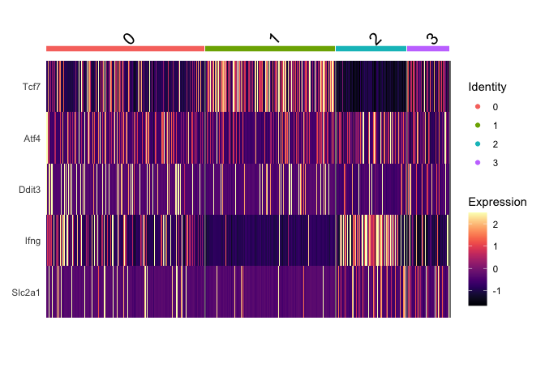
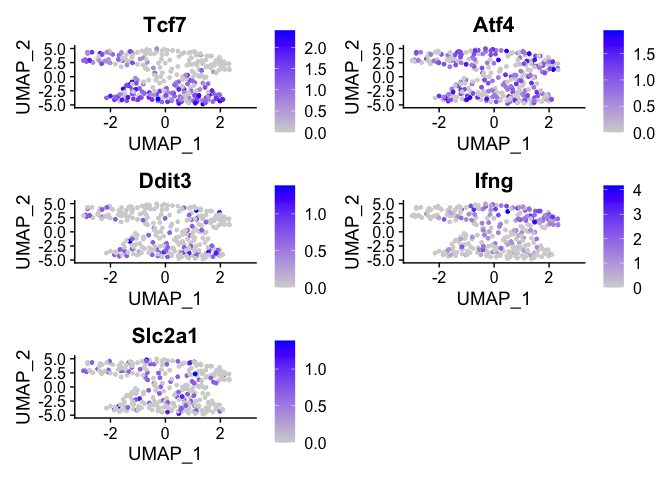

CD8\_analysis2
================
pattiey
21/10/2021

Analysis of CD8+ T cells. Much of this is borrowed from the workflow
found in the paper of the original dataset (Carmona et al.) found here
<https://gitlab.unil.ch/carmona/workflow_Carmona_etal_2019_CD8TIL_Sv3/blob/master/workflow1.Rmd>

``` r
library(Seurat)
library(clusterProfiler)
library(dplyr)
library(tidyr)
library(Matrix)
library(sctransform)
library(ggplot2)
library(ggpubr)
library(RColorBrewer)
library(viridis)
library(ComplexHeatmap)
library(circlize)
library(goseq)
```

``` r
source("cd8_analysis.R")
```

Read sparse matrix

``` r
fname <- "input/B16_data"
data <- Read10X(fname)
(data.seurat <- CreateSeuratObject(counts = data, 
                                   project = "B16CD8",
                                   min.cells = 3, 
                                   min.features = 50))
```

    ## Warning: Feature names cannot have underscores ('_'), replacing with dashes
    ## ('-')

    ## An object of class Seurat 
    ## 13363 features across 3574 samples within 1 assay 
    ## Active assay: RNA (13363 features, 0 variable features)

Determine proportion of mitochondrial and ribosomal genes

``` r
data.seurat[["percent.mito"]] <- PercentageFeatureSet(data.seurat, pattern = "^mt-")
data.seurat[["percent.ribo"]] <- PercentageFeatureSet(data.seurat, pattern = "^Rp[ls]")
```

``` r
sampleIDs <- qq(PMEL1, WT1, WT3, PMEL3, PMEL2, WT2, WT4)
names(sampleIDs) <- 1:7
```

``` r
data.seurat[["Sample"]] <- factor(substring(rownames(data.seurat@meta.data), 18))
data.seurat[["SampleLabel"]] <- factor(sampleIDs[data.seurat@meta.data$Sample])
```

Normalize UMI count data with SCTransform

Run PCA

``` r
set.seed(123)
DefaultAssay(object = data.seurat) <- "SCT"
data.seurat <- RunPCA(data.seurat, ndims.print = 1:5, nfeatures.print = 10)
```

    ## PC_ 1 
    ## Positive:  Rps27, Rps24, Rps29, Klf2, Sell, Rps28, Rpl37a, Il7r, Rps20, Tpt1 
    ## Negative:  Lgals1, S100a6, Tmsb4x, Hmgb2, Gzmb, Stmn1, 2810417H13Rik, S100a4, Birc5, Anxa2 
    ## PC_ 2 
    ## Positive:  2810417H13Rik, Tuba1b, Stmn1, Ptma, Rpl41, Hist1h2ap, H2afz, Birc5, Rps20, Dut 
    ## Negative:  Ccl5, S100a6, Ifi27l2a, Ms4a4b, Gzmk, Nkg7, Tmsb4x, Cxcr6, Gzmb, AW112010 
    ## PC_ 3 
    ## Positive:  Tnfrsf9, Rgs16, Ccl3, Tnfrsf4, Bhlhe40, Ccl4, Pdcd1, Lgals1, Anxa2, Tigit 
    ## Negative:  Hmgb2, Birc5, Hist1h2ap, Stmn1, Tuba1b, 2810417H13Rik, Tubb5, Ly6c2, Ccna2, Ube2c 
    ## PC_ 4 
    ## Positive:  Ly6c2, Isg15, Gzmb, Actb, Ly6a, Tmsb10, Tmsb4x, Ifit3, Bst2, Mif 
    ## Negative:  Junb, Tnfaip3, Btg1, Dusp1, Gm42418, Pnrc1, Rgs16, Klf2, Ccr7, Nfkbia 
    ## PC_ 5 
    ## Positive:  Isg15, Ifit3, Ifit1, Ifi27l2a, Junb, Ly6a, Bst2, Nfkbia, Irf7, Usp18 
    ## Negative:  Ccl5, Tmsb4x, S100a6, Actg1, Actb, Gzmk, S100a10, Lgals1, Crip1, Pfn1

Remove cell cycle (excluding our genes of interest), ribosomal, and
mitochondrial genes from genes used for dimensionality reduction.

``` r
cellCycle.genes <- read.csv("cellCycleGenes.csv", as.is = T)$x
mito.genes <- grep(pattern = "^mt-", x = rownames(x = data.seurat@assays$RNA@data), value = TRUE)
ribo.genes <- grep(pattern = "^Rp[ls]", x = rownames(x = data.seurat@assays$RNA@data), value = TRUE)
```

``` r
length(data.seurat@assays$SCT@var.features)
```

    ## [1] 10000

``` r
data.seurat@assays$SCT@var.features <-
  data.seurat@assays$SCT@var.features[!data.seurat@assays$SCT@var.features %in% 
                                        c(mito.genes,ribo.genes, cellCycle.genes)]
length(data.seurat@assays$SCT@var.features)
```

    ## [1] 8973

Run dimensionality reduction with mitochondrial and ribosomal genes
removed

``` r
data.seurat <- dim_reductions(data.seurat, seed = 123)
```

    ## PC_ 1 
    ## Positive:  Klf2, Sell, Il7r, Tcf7, Ccr7, Tpt1, Dapl1, Satb1, Gm10073, Nsg2 
    ## Negative:  S100a6, Lgals1, Tmsb4x, Gzmb, Ccl5, S100a4, Ccl4, Anxa2, Rgs16, Ccl3 
    ## PC_ 2 
    ## Positive:  Ccl5, S100a6, Ms4a4b, Ly6c2, Ifi27l2a, Gzmk, Ms4a6b, Cd7, Malat1, Isg15 
    ## Negative:  Dut, Tnfrsf9, Ptma, Rgs16, Xcl1, Tnfrsf4, Eef1a1, Eif5a, Nrgn, Cd74 
    ## PC_ 3 
    ## Positive:  Ly6c2, Isg15, Ptma, Tmsb10, Ly6a, Ifit3, Tmsb4x, Gzmb, Bst2, Ppia 
    ## Negative:  Rgs16, Gm42418, Bhlhe40, Tigit, Nfkbia, Pnrc1, Tnfrsf4, Ccr7, Klrd1, Nrn1 
    ## PC_ 4 
    ## Positive:  Ccl5, S100a6, Crip1, Gzmk, Tmsb4x, Actg1, Cd7, Gzma, Pfn1, Itga4 
    ## Negative:  Isg15, Ifit3, Ifi27l2a, Ifit1, Ly6a, Bst2, Irf7, Isg20, Usp18, Ifit3b 
    ## PC_ 5 
    ## Positive:  Ifi27l2a, Plac8, Gapdh, Tpi1, Cd74, Dapl1, S100a10, Aldoa, Pgk1, Nrn1 
    ## Negative:  Ccl4, Ccl5, Ccl3, Ly6c2, Zfp36, Dusp2, Ifng, Fos, Nkg7, Nfkbia

    ## Warning: The default method for RunUMAP has changed from calling Python UMAP via reticulate to the R-native UWOT using the cosine metric
    ## To use Python UMAP via reticulate, set umap.method to 'umap-learn' and metric to 'correlation'
    ## This message will be shown once per session

    ## 16:18:56 UMAP embedding parameters a = 0.9922 b = 1.112

    ## 16:18:56 Read 3574 rows and found 10 numeric columns

    ## 16:18:56 Using Annoy for neighbor search, n_neighbors = 30

    ## 16:18:56 Building Annoy index with metric = cosine, n_trees = 50

    ## 0%   10   20   30   40   50   60   70   80   90   100%

    ## [----|----|----|----|----|----|----|----|----|----|

    ## **************************************************|
    ## 16:18:56 Writing NN index file to temp file /var/folders/1f/5679s20d5gq3zmx40pr76lgc0000gp/T//RtmpSxW6mY/file3ad7a546aed
    ## 16:18:56 Searching Annoy index using 1 thread, search_k = 3000
    ## 16:18:57 Annoy recall = 100%
    ## 16:18:58 Commencing smooth kNN distance calibration using 1 thread
    ## 16:18:59 Initializing from normalized Laplacian + noise
    ## 16:18:59 Commencing optimization for 500 epochs, with 144300 positive edges
    ## 16:19:04 Optimization finished

PCA coloured by the 5 genes of interest

``` r
genes_of_interest <- c("Tcf7","Atf4", "Ddit3", "Ifng", "Slc2a1")
FeaturePlot(data.seurat,features=genes_of_interest,reduction="pca") 
```

<!-- -->

``` r
FeaturePlot(data.seurat, features=genes_of_interest, dims = c(5,4), reduction = "pca")
```

<!-- -->

Use KNN to find neighbours on PCA dimensions

``` r
set.seed(123)
data.seurat <- FindNeighbors(data.seurat, reduction = "pca", dims = 1:10,k.param = 30)
```

    ## Computing nearest neighbor graph

    ## Computing SNN

``` r
set.seed(123)
data.seurat  <- FindClusters(data.seurat, resolution = 0.3)
```

    ## Modularity Optimizer version 1.3.0 by Ludo Waltman and Nees Jan van Eck
    ## 
    ## Number of nodes: 3574
    ## Number of edges: 195396
    ## 
    ## Running Louvain algorithm...
    ## Maximum modularity in 10 random starts: 0.8683
    ## Number of communities: 4
    ## Elapsed time: 0 seconds

Add original inferred cell state clustering to meta data

``` r
pre.clusters <- read.csv("cellClusters.csv")
pre.clusters.meta <- pre.clusters[match(colnames(data.seurat),pre.clusters$X),2]
names(pre.clusters.meta) <- colnames(data.seurat)
pre.clusters.meta <- factor(pre.clusters.meta,levels=c("Naive","EM-like","MemoryLike","Exhausted"))
data.seurat <- AddMetaData(data.seurat,pre.clusters.meta,"original_clusters")
```

UMAP plot coloured by pca clusters and the original clusters

``` r
clusterColors <- c("#F8766D","#A58AFF","#00B6EB","#53B400","#E8E8E8")
names(clusterColors) <- c("Naive","EM-like","MemoryLike","Exhausted","Cycling") 
side_by_side_cluster_plot(data.seurat, 
                          reduction = "umap", 
                          group.by1 = "original_clusters", 
                          group.by2 = "seurat_clusters",
                          clusterColors = clusterColors)
```

<!-- -->

tSNE plot coloured by pca clusters and the original clusters

``` r
side_by_side_cluster_plot(data.seurat, 
                          reduction = "tsne", 
                          group.by1 = "original_clusters", 
                          group.by2 = "seurat_clusters", 
                          clusterColors = clusterColors)
```

<!-- -->

Cluster based on UMAP dimensions

``` r
set.seed(123)
data.seurat <- FindNeighbors(data.seurat, reduction = "umap", dims = 1:2, k.param = 30)
```

    ## Computing nearest neighbor graph

    ## Computing SNN

``` r
set.seed(123)
data.seurat  <- FindClusters(data.seurat, resolution = 0.08)
```

    ## Modularity Optimizer version 1.3.0 by Ludo Waltman and Nees Jan van Eck
    ## 
    ## Number of nodes: 3574
    ## Number of edges: 122174
    ## 
    ## Running Louvain algorithm...
    ## Maximum modularity in 10 random starts: 0.9652
    ## Number of communities: 4
    ## Elapsed time: 0 seconds

UMAP plot coloured by UMAP clusters and the original clusters

``` r
side_by_side_cluster_plot(data.seurat, 
                          reduction = "umap", 
                          group.by1 = "original_clusters",
                          group.by2 = "seurat_clusters", 
                          clusterColors = clusterColors)
```

<!-- -->

tSNE plot coloured by UMAP clusters and the original clusters

``` r
side_by_side_cluster_plot(data.seurat, 
                          reduction = "tsne", 
                          group.by1 = "original_clusters",
                          group.by2 = "seurat_clusters", 
                          clusterColors = clusterColors)
```

<!-- -->

``` r
FeaturePlot(data.seurat,features=genes_of_interest,reduction="tsne") 
```

<!-- -->

``` r
FeaturePlot(data.seurat,features=genes_of_interest,reduction="umap") 
```

<!-- -->

``` r
DoHeatmap(data.seurat, features = genes_of_interest, group.by = "original_clusters", raster = FALSE) + scale_fill_viridis(option = "magma")
```

    ## Scale for 'fill' is already present. Adding another scale for 'fill', which
    ## will replace the existing scale.

<!-- -->

``` r
DoHeatmap(data.seurat, features = genes_of_interest, group.by = "seurat_clusters", raster = FALSE) + scale_fill_viridis(option = "magma")
```

    ## Scale for 'fill' is already present. Adding another scale for 'fill', which
    ## will replace the existing scale.

<!-- -->

Now look only at subsets of cells by inferred cell state. To maintain
consistency, I’ll use the inferred cell states given by
`original_clusters`, even if the UMAP clustering may be more accurate.

``` r
Idents(data.seurat) <- "original_clusters"
```

### Naive

``` r
naive <- subset_setup(data.seurat, idents = "Naive")
naive <- dim_reductions(naive, seed = 123)
```

    ## PC_ 1 
    ## Positive:  Tmsb10, Mif, Ppia, Hsp90ab1, Ptma, Rpl41, Ran, Tuba1b, Tmsb4x, Gapdh 
    ## Negative:  Rps27, Malat1, Klf2, Gm42418, Btg1, Ccl5, Tpt1, Il7r, Tsc22d3, Junb 
    ## PC_ 2 
    ## Positive:  Rps29, Rps24, Rps28, Rps20, Rplp0, Rps4x, Rps3a1, Rps27, Rpl35a, Gm9493 
    ## Negative:  Ccl5, Junb, S100a6, Tnfaip3, Btg1, Pnrc1, Nfkbia, H3f3b, Klrc1, Dusp1 
    ## PC_ 3 
    ## Positive:  Junb, Gm42418, Rps29, Rps8, Rplp1, Ier2, Klf2, Nfkbia, Rps2, Eef1a1 
    ## Negative:  Ifi27l2a, Ly6c2, Ly6a, Isg15, Ifit3, Zbp1, Rtp4, Irf7, Ms4a4b, Actb 
    ## PC_ 4 
    ## Positive:  Ccl5, Ly6c2, S100a6, Nkg7, Vim, Ctla2a, Tmsb4x, Rps12, Hopx, Tmsb10 
    ## Negative:  Hmgb2, Dapl1, Stmn1, Malat1, 2810417H13Rik, Lef1, Smc4, Hmgn2, Gm10282, Hist1h2ap 
    ## PC_ 5 
    ## Positive:  Tmsb4x, Lgals1, Vim, Crip1, Tmsb10, S100a6, Ccl5, Cd52, Rac2, Sh3bgrl3 
    ## Negative:  Ly6a, Ifi27l2a, Isg15, Bst2, Stat1, Gbp2, Eif5a, Ifit3, Irf7, Igtp

    ## 16:19:55 UMAP embedding parameters a = 0.9922 b = 1.112

    ## 16:19:55 Read 1292 rows and found 10 numeric columns

    ## 16:19:55 Using Annoy for neighbor search, n_neighbors = 30

    ## 16:19:55 Building Annoy index with metric = cosine, n_trees = 50

    ## 0%   10   20   30   40   50   60   70   80   90   100%

    ## [----|----|----|----|----|----|----|----|----|----|

    ## **************************************************|
    ## 16:19:55 Writing NN index file to temp file /var/folders/1f/5679s20d5gq3zmx40pr76lgc0000gp/T//RtmpSxW6mY/file3ad532841cc
    ## 16:19:55 Searching Annoy index using 1 thread, search_k = 3000
    ## 16:19:55 Annoy recall = 100%
    ## 16:19:56 Commencing smooth kNN distance calibration using 1 thread
    ## 16:19:57 Initializing from normalized Laplacian + noise
    ## 16:19:57 Commencing optimization for 500 epochs, with 47422 positive edges
    ## 16:19:59 Optimization finished

``` r
FeaturePlot(naive, features = genes_of_interest, reduction = "pca") 
```

<!-- -->

``` r
FeaturePlot(naive, features = genes_of_interest, reduction = "umap") 
```

<!-- -->

``` r
naive_correlations <- subset_correlations(naive, genes_of_interest)
```

<!-- -->

``` r
naive_highly_correlated <- subset_highly_correlated(naive_correlations, genes_of_interest, n_to_pull = 100)
```

    ## Warning in xtfrm.data.frame(x): cannot xtfrm data frames

    ## Warning in xtfrm.data.frame(x): cannot xtfrm data frames

    ## Warning in xtfrm.data.frame(x): cannot xtfrm data frames

    ## Warning in xtfrm.data.frame(x): cannot xtfrm data frames

    ## Warning in xtfrm.data.frame(x): cannot xtfrm data frames

    ## Warning in xtfrm.data.frame(x): cannot xtfrm data frames

    ## Warning in xtfrm.data.frame(x): cannot xtfrm data frames

    ## Warning in xtfrm.data.frame(x): cannot xtfrm data frames

    ## Warning in xtfrm.data.frame(x): cannot xtfrm data frames

    ## Warning in xtfrm.data.frame(x): cannot xtfrm data frames

``` r
Heatmap(naive_highly_correlated, show_row_names = FALSE)
```

    ## The automatically generated colors map from the minus and plus 99^th of
    ## the absolute values in the matrix. There are outliers in the matrix
    ## whose patterns might be hidden by this color mapping. You can manually
    ## set the color to `col` argument.
    ## 
    ## Use `suppressMessages()` to turn off this message.

<!-- -->

``` r
heatmap_correlated_genes(naive, naive_highly_correlated)
```

    ## The automatically generated colors map from the minus and plus 99^th of
    ## the absolute values in the matrix. There are outliers in the matrix
    ## whose patterns might be hidden by this color mapping. You can manually
    ## set the color to `col` argument.
    ## 
    ## Use `suppressMessages()` to turn off this message.

<!-- -->

### EM-like

``` r
em_like <- subset_setup(data.seurat, idents = "EM-like")
em_like <- dim_reductions(em_like, seed = 123)
```

    ## PC_ 1 
    ## Positive:  Rps27, Rps24, Rpl37a, Rps28, Rps29, Rps21, Rps15a, Rpl13, Junb, Il7r 
    ## Negative:  Hmgb2, Stmn1, Hmgn2, Birc5, Gm10282, 2810417H13Rik, Tuba1b, Hist1h2ap, H2afz, Cks1b 
    ## PC_ 2 
    ## Positive:  Gzmb, Ccl5, Actb, S100a6, Cxcr6, S100a4, Tmsb4x, Ms4a4b, Isg15, Actg1 
    ## Negative:  Rps29, Rps24, Rps20, Rps27, Rps28, Rpl13, Rpsa, Rpl39, Rps19, Rplp1 
    ## PC_ 3 
    ## Positive:  Junb, Isg15, Tnfaip3, Ifit3, Btg1, Nfkbia, Dusp1, Ifit1, Zfp36, Fos 
    ## Negative:  Ccl5, Actg1, Actb, Tmsb4x, Pfn1, S100a6, Plac8, Gzma, Rplp0, Cd52 
    ## PC_ 4 
    ## Positive:  Ccl5, Junb, Tnfaip3, Cd7, Nr4a1, Zfp36l2, Btg1, Ccl4, Dusp2, Dusp1 
    ## Negative:  Isg15, Ly6c2, Ifit3, Ifi27l2a, Ifit1, Ly6a, Bst2, Isg20, Irf7, Usp18 
    ## PC_ 5 
    ## Positive:  Ccl5, Plac8, Gzmk, Tpi1, Aldoa, Ifi27l2a, Malat1, Rnf138, Itga4, Gpi1 
    ## Negative:  Vim, Lgals1, S100a6, Tmsb10, Actb, Tmsb4x, Capg, Cd52, Crip1, Pfn1

    ## 16:20:43 UMAP embedding parameters a = 0.9922 b = 1.112

    ## 16:20:43 Read 1415 rows and found 10 numeric columns

    ## 16:20:43 Using Annoy for neighbor search, n_neighbors = 30

    ## 16:20:43 Building Annoy index with metric = cosine, n_trees = 50

    ## 0%   10   20   30   40   50   60   70   80   90   100%

    ## [----|----|----|----|----|----|----|----|----|----|

    ## **************************************************|
    ## 16:20:43 Writing NN index file to temp file /var/folders/1f/5679s20d5gq3zmx40pr76lgc0000gp/T//RtmpSxW6mY/file3ad2c7861ca
    ## 16:20:43 Searching Annoy index using 1 thread, search_k = 3000
    ## 16:20:44 Annoy recall = 100%
    ## 16:20:45 Commencing smooth kNN distance calibration using 1 thread
    ## 16:20:46 Initializing from normalized Laplacian + noise
    ## 16:20:46 Commencing optimization for 500 epochs, with 53478 positive edges
    ## 16:20:48 Optimization finished

``` r
FeaturePlot(em_like, features = genes_of_interest, reduction = "pca") 
```

<!-- -->

``` r
FeaturePlot(em_like, features = genes_of_interest, reduction = "umap") 
```

<!-- -->

``` r
em_correlations <- subset_correlations(em_like, genes_of_interest)
```

<!-- -->

``` r
em_highly_correlated <- subset_highly_correlated(em_correlations, genes_of_interest, n_to_pull = 100)
```

    ## Warning in xtfrm.data.frame(x): cannot xtfrm data frames

    ## Warning in xtfrm.data.frame(x): cannot xtfrm data frames

    ## Warning in xtfrm.data.frame(x): cannot xtfrm data frames

    ## Warning in xtfrm.data.frame(x): cannot xtfrm data frames

    ## Warning in xtfrm.data.frame(x): cannot xtfrm data frames

    ## Warning in xtfrm.data.frame(x): cannot xtfrm data frames

    ## Warning in xtfrm.data.frame(x): cannot xtfrm data frames

    ## Warning in xtfrm.data.frame(x): cannot xtfrm data frames

    ## Warning in xtfrm.data.frame(x): cannot xtfrm data frames

    ## Warning in xtfrm.data.frame(x): cannot xtfrm data frames

``` r
Heatmap(em_highly_correlated)
```

    ## The automatically generated colors map from the minus and plus 99^th of
    ## the absolute values in the matrix. There are outliers in the matrix
    ## whose patterns might be hidden by this color mapping. You can manually
    ## set the color to `col` argument.
    ## 
    ## Use `suppressMessages()` to turn off this message.

<!-- -->

``` r
heatmap_correlated_genes(em_like, em_highly_correlated)
```

<!-- -->

### Memory-like

``` r
memory_like <- subset_setup(data.seurat, idents = "MemoryLike")
memory_like <- dim_reductions(memory_like, seed = 123)
```

    ## PC_ 1 
    ## Positive:  Ptma, Ppia, Ran, Eif5a, Gclm, Tuba1b, Xcl1, Ranbp1, Mif, Erh 
    ## Negative:  Rps15a, Rps27, Fau, Ypel3, mt-Co1, Btg1, Rpl39, Rps24, Pnrc1, Gm8369 
    ## PC_ 2 
    ## Positive:  S100a6, Nkg7, Ccl5, S100a4, Cxcr6, Cd52, Ccl4, Ifng, Srgn, Cd8a 
    ## Negative:  Rps20, Rpl41, Rplp0, Rpsa, Rps2, Rpl13, Rps18, Rpl32, Npm1, Rps26 
    ## PC_ 3 
    ## Positive:  Ppan, Rps27, Nhp2, Fbl, Eif5a, Cnbp, Ddx21, Hspe1, Ncl, Rrp9 
    ## Negative:  Vim, Hmgb2, H2afz, 2810417H13Rik, Stmn1, Lgals1, H2afv, Crip1, Gm10282, S100a10 
    ## PC_ 4 
    ## Positive:  Gapdh, Rpl41, Tnfrsf4, Cd74, Nrn1, Rps2, Rps26, Rpl13, Lgals1, Aldoa 
    ## Negative:  Btg1, Nr4a1, Klf2, Btg2, Zfp36l2, Tnfaip3, Top2a, Rrm2, Zfp36, Pnrc1 
    ## PC_ 5 
    ## Positive:  Xist, Ikzf2, Malat1, Id3, Ms4a4b, Gimap7, Il10ra, Ctse, Actb, Rsrp1 
    ## Negative:  Junb, Nfkbia, S100a6, Rps2, Xcl1, Eef1a1, Ccl1, Cd83, Ccr7, Bcl2a1d

    ## 16:21:09 UMAP embedding parameters a = 0.9922 b = 1.112

    ## 16:21:09 Read 300 rows and found 10 numeric columns

    ## 16:21:09 Using Annoy for neighbor search, n_neighbors = 30

    ## 16:21:09 Building Annoy index with metric = cosine, n_trees = 50

    ## 0%   10   20   30   40   50   60   70   80   90   100%

    ## [----|----|----|----|----|----|----|----|----|----|

    ## **************************************************|
    ## 16:21:09 Writing NN index file to temp file /var/folders/1f/5679s20d5gq3zmx40pr76lgc0000gp/T//RtmpSxW6mY/file3ad2dcb20db
    ## 16:21:09 Searching Annoy index using 1 thread, search_k = 3000
    ## 16:21:09 Annoy recall = 100%
    ## 16:21:10 Commencing smooth kNN distance calibration using 1 thread
    ## 16:21:11 Initializing from normalized Laplacian + noise
    ## 16:21:11 Commencing optimization for 500 epochs, with 10946 positive edges
    ## 16:21:12 Optimization finished

``` r
FeaturePlot(memory_like, features = genes_of_interest, reduction = "pca") 
```

<!-- -->

``` r
FeaturePlot(memory_like, features = genes_of_interest, reduction = "umap") 
```

<!-- -->

``` r
memory_correlations <- subset_correlations(memory_like, genes_of_interest)
```

<!-- -->

``` r
memory_highly_correlated <- subset_highly_correlated(memory_correlations, genes_of_interest, n_to_pull = 100)
```

    ## Warning in xtfrm.data.frame(x): cannot xtfrm data frames

    ## Warning in xtfrm.data.frame(x): cannot xtfrm data frames

    ## Warning in xtfrm.data.frame(x): cannot xtfrm data frames

    ## Warning in xtfrm.data.frame(x): cannot xtfrm data frames

    ## Warning in xtfrm.data.frame(x): cannot xtfrm data frames

    ## Warning in xtfrm.data.frame(x): cannot xtfrm data frames

    ## Warning in xtfrm.data.frame(x): cannot xtfrm data frames

    ## Warning in xtfrm.data.frame(x): cannot xtfrm data frames

    ## Warning in xtfrm.data.frame(x): cannot xtfrm data frames

    ## Warning in xtfrm.data.frame(x): cannot xtfrm data frames

``` r
Heatmap(memory_highly_correlated)
```

<!-- -->

``` r
heatmap_correlated_genes(memory_like, memory_highly_correlated)
```

<!-- -->

### Exhausted

``` r
exhausted <- subset_setup(data.seurat, idents = "Exhausted")
exhausted <- dim_reductions(exhausted, seed = 123)
```

    ## PC_ 1 
    ## Positive:  H2afz, 2810417H13Rik, Ptma, Hmgb2, Stmn1, Tuba1b, Hist1h2ap, Ppia, Hmgn2, Hmgb1 
    ## Negative:  Ccl5, S100a6, Nkg7, Ifi27l2a, Ms4a4b, Klrd1, Btg1, Hcst, Ctla2a, Lgals3 
    ## PC_ 2 
    ## Positive:  Ms4a4b, Ccl5, Ly6c2, Ifi27l2a, Birc5, Tubb5, Crip1, Tubb4b, Hmgb2, Actb 
    ## Negative:  Rps26, Rplp0, Rpl41, Rps2, Rpl13, Eef1a1, Rpsa, Rpl32, Rpl37, Rps18 
    ## PC_ 3 
    ## Positive:  Rps15a, Rps27, Rpl39, Rps24, H2afx, H2afv, Rps20, Ube2c, Birc5, Rpl18a 
    ## Negative:  Actb, Ldha, Ccl3, Gzmb, Ccl4, Anxa2, Eno1, Prf1, Gapdh, Tnfrsf9 
    ## PC_ 4 
    ## Positive:  Ccl5, Ms4a4b, Nkg7, Rps27, Mcm6, Ifi27l2a, Tipin, Ccl4, Hcst, Ly6c2 
    ## Negative:  Actg1, Cenpa, Plac8, Aldoa, Ccnb2, Gapdh, Ube2c, Anxa2, Vim, Gzmb 
    ## PC_ 5 
    ## Positive:  Gm10282, Hmgn2, Pfn1, Ccnb2, Crip1, Tmsb4x, Tmsb10, 2700094K13Rik, Cfl1, Gzmk 
    ## Negative:  Tnfrsf9, Tnfrsf4, Gm42418, Prf1, Sdf4, Malat1, Serpine2, Nrgn, Stat3, Aldoa

    ## 16:21:33 UMAP embedding parameters a = 0.9922 b = 1.112

    ## 16:21:33 Read 567 rows and found 10 numeric columns

    ## 16:21:33 Using Annoy for neighbor search, n_neighbors = 30

    ## 16:21:33 Building Annoy index with metric = cosine, n_trees = 50

    ## 0%   10   20   30   40   50   60   70   80   90   100%

    ## [----|----|----|----|----|----|----|----|----|----|

    ## **************************************************|
    ## 16:21:33 Writing NN index file to temp file /var/folders/1f/5679s20d5gq3zmx40pr76lgc0000gp/T//RtmpSxW6mY/file3ad3d50c13
    ## 16:21:33 Searching Annoy index using 1 thread, search_k = 3000
    ## 16:21:33 Annoy recall = 100%
    ## 16:21:33 Commencing smooth kNN distance calibration using 1 thread
    ## 16:21:35 Initializing from normalized Laplacian + noise
    ## 16:21:35 Commencing optimization for 500 epochs, with 21316 positive edges
    ## 16:21:36 Optimization finished

``` r
FeaturePlot(exhausted, features = genes_of_interest, reduction = "pca") 
```

<!-- -->

``` r
FeaturePlot(exhausted, features = genes_of_interest, reduction = "umap") 
```

<!-- -->

``` r
exhausted_correlations <- subset_correlations(exhausted, genes_of_interest)
```

<!-- -->

``` r
exhausted_highly_correlated <- subset_highly_correlated(exhausted_correlations, genes_of_interest, n_to_pull = 100)
```

    ## Warning in xtfrm.data.frame(x): cannot xtfrm data frames

    ## Warning in xtfrm.data.frame(x): cannot xtfrm data frames

    ## Warning in xtfrm.data.frame(x): cannot xtfrm data frames

    ## Warning in xtfrm.data.frame(x): cannot xtfrm data frames

    ## Warning in xtfrm.data.frame(x): cannot xtfrm data frames

    ## Warning in xtfrm.data.frame(x): cannot xtfrm data frames

    ## Warning in xtfrm.data.frame(x): cannot xtfrm data frames

    ## Warning in xtfrm.data.frame(x): cannot xtfrm data frames

    ## Warning in xtfrm.data.frame(x): cannot xtfrm data frames

    ## Warning in xtfrm.data.frame(x): cannot xtfrm data frames

``` r
Heatmap(exhausted_highly_correlated)
```

    ## The automatically generated colors map from the minus and plus 99^th of
    ## the absolute values in the matrix. There are outliers in the matrix
    ## whose patterns might be hidden by this color mapping. You can manually
    ## set the color to `col` argument.
    ## 
    ## Use `suppressMessages()` to turn off this message.

<!-- -->

``` r
heatmap_correlated_genes(exhausted, exhausted_highly_correlated)
```

<!-- -->

## Alternative clustering?

See if any different patterns emerge if UMAP clustering is used over the
original given clustering.

``` r
Idents(data.seurat) <- "seurat_clusters"
```

### Naive

``` r
umap_naive <- subset(data.seurat, idents = 1)
```

### EM like

``` r
umap_em <- subset(data.seurat, idents = 0)
```

### Memory like

``` r
umap_memory <- subset(data.seurat, idents = 3)
```

### Exhausted

``` r
umap_exhausted <- subset(data.seurat, idents = 2)
```
